# TRUTHFORGE AI ⚖️

**Forging Truth from Legal Testimony Using Multi-Agent AI**

A multi-agent AI system that detects factual inconsistencies in legal transcripts and court testimonies. Built on LangGraph and LangChain, TRUTHFORGE AI coordinates six specialised agents through a structured pipeline to convert raw legal text into actionable analytical reports.

> **NUS SWE5008 — Architecting AI Systems**
> Team: Jia XingJie (A0139137A), Sharvash Subhash (A0327428Y), Thun Zhen Hong (A0331639B)

---

## Features

- **Six specialist agents**: Responsible_AI_Security_Agent, Transcript Processing, Timeline Reconstruction, Consistency Analysis, Explainability, Orchestrator_Agent
- **Cloud & local model support**: Claude, GPT-4o, Gemini, Llama (Ollama), Mistral (Ollama), LM Studio
- **Provider-agnostic pipeline**: Switch models from the sidebar without changing any code
- **Responsible AI**: Aligned with Singapore's Model AI Governance Framework for Agentic AI
- **73 automated tests**: Unit, integration, and adversarial security scenarios
- **Streamlit UI**: Live pipeline progress with 8-tab results display

---

## Architecture

```
User Upload (Streamlit)
        ↓
 [Security Input Gate]  ──blocked──→ END (Security Alert)
        ↓ safe
[Transcript Processing]   NER + event extraction
        ↓
[Timeline Reconstruction] Temporal normalisation
        ↓
[Consistency Analysis]    Contradiction detection
        ↓
[Explainability]          Human-readable explanations
        ↓
 [Security Output Gate]   Legal neutrality filter
        ↓
  Final Report (UI)
```

---

## Quick Start

### Prerequisites

- Python 3.11+
- At least one of: Anthropic API key, OpenAI API key, Google API key, or Ollama running locally

### 1. Clone and install

```bash
git clone <repo-url>
cd truthforge
pip install -r requirements.txt
python -m spacy download en_core_web_sm
```

### 2. Configure API keys

```bash
cp .env.example .env
# Edit .env with your API keys
```

```env
# At minimum, provide one of:
ANTHROPIC_API_KEY=sk-ant-...
OPENAI_API_KEY=sk-...
GOOGLE_API_KEY=...
```

### 3. Run the app

```bash
streamlit run main.py
```

Open http://localhost:8501 in your browser.

---

## Using the App

### Step 1: Select a model
In the sidebar, choose between:
- **Cloud**: Claude Sonnet 4.6, GPT-4o, GPT-4o Mini, Gemini 2.0 Flash
- **Local**: Llama 3.1 8B (Ollama), Mistral 7B (Ollama), Phi-3 Mini (Ollama), LM Studio

### Step 2: Upload a transcript
Supported formats: `.txt`, `.pdf`, `.docx`

Or use the built-in demo transcript to see the system in action.

### Step 3: Run analysis
Click **"Run Analysis"** and watch the 6-agent pipeline execute with live progress.

### Step 4: Review results
Results are displayed across 8 tabs:
| Tab | Contents |
|---|---|
| Summary | Metrics: entities, events, inconsistencies, severity |
| Entities | Named entities extracted (JUDGE, WITNESS, DEFENDANT, etc.) |
| Timeline | Chronologically ordered events with confidence scores |
| Inconsistencies | Detected contradictions with severity ratings |
| Explanations | Plain-English analysis with evidence quotes |
| Security | Input/output security check results |
| Audit Log | Full agent-by-agent execution trace |
| Full Report | Complete Markdown report (downloadable) |

---

## Demo Scenarios

### Scenario 1 — Clean transcript
No inconsistencies detected, responsible AI (not over-detecting).

### Scenario 2 — Contradictory transcript
Time discrepancy detected (PW1 says 10:32pm, police statement says 9:45pm). Location conflict (defendant placed at two locations simultaneously).

### Scenario 3 — Adversarial transcript
Security agent blocks the input immediately. Pipeline halts with a Security Alert.

### Scenario 4 — Model switching
Repeat Scenario 2 with different providers — same pipeline structure, provider-agnostic output.

---

## Local Models (Ollama)

```bash
# Install Ollama
brew install ollama   # macOS
# or visit https://ollama.ai

# Pull a model
ollama pull llama3.1:8b
ollama pull mistral:7b

# Start Ollama server (runs automatically on macOS)
ollama serve
```

In the sidebar, select **Local** → choose your Ollama model.

### LM Studio

1. Download [LM Studio](https://lmstudio.ai/)
2. Load any GGUF model
3. Start the local server (default: `http://localhost:1234`)
4. In the sidebar, select **Local** → **LM Studio**, then enter your model name

---

## Docker Deployment

```bash
# Standard deployment
docker-compose up

# Scale to multiple replicas (~30-50 concurrent sessions)
docker-compose up --scale truthforge=3

# With Ollama (fully local, no API keys needed)
docker-compose --profile local up
```

App available at http://localhost:8501

---

## Running Tests

```bash
# All tests (no API keys required — uses fallback mode)
pytest tests/ -v

# By category
pytest tests/unit/ -v           # 43 unit tests
pytest tests/integration/ -v    # 10 integration tests
pytest tests/security/ -v       # 20 security tests

# With coverage
pytest tests/ --cov=agents --cov=core --cov-report=term-missing
```

### Test coverage

| Suite | Tests | Requires API Key? |
|---|---|---|
| Unit — Security Agent | 12 | No (deterministic) |
| Unit — Transcript Processing | 9 | No (fallback mode) |
| Unit — Timeline Reconstruction | 8 | No (fallback mode) |
| Unit — Consistency Analysis | 6 | No (fallback mode) |
| Unit — Explainability | 8 | No (fallback mode) |
| Integration — E2E Pipeline | 8 | No (fallback mode) |
| Integration — Model Switching | 12 | No (mocked LLM) |
| Security — Injection | 13 | No (deterministic) |
| Security — Output Filter | 7 | No (deterministic) |
| **Total** | **83** | **None** |

---

## Project Structure

```
truthforge/
├── main.py                              # Streamlit entry point
├── config.py                            # Model provider registry
├── requirements.txt
├── docker-compose.yml
├── Dockerfile
├── .env.example
├── agents/
│   ├── responsible_ai_security_agent.py # Input gate + output filter
│   ├── transcript_processing_agent.py   # spaCy NER + LLM event extraction
│   ├── timeline_reconstruction_agent.py # Temporal normalisation + ordering
│   ├── consistency_analysis_agent.py    # Contradiction detection
│   ├── explainability_agent.py          # Human-readable explanation gen
│   └── orchestration_agent.py           # LangGraph StateGraph supervisor
├── core/
│   ├── state.py                         # TruthForgeState TypedDict
│   ├── memory.py                        # InMemorySaver + session IDs
│   └── logger.py                        # structlog audit logger
├── pipeline/
│   └── graph.py                         # LangGraph graph exports
├── ui/
│   ├── sidebar.py                       # Model selector sidebar
│   ├── upload.py                        # File upload + text extraction
│   └── results.py                       # 8-tab results display
├── tests/
   ├── fixtures/
   │   ├── clean_transcript.txt
   │   ├── contradictory_transcript.txt
   │   └── injection_transcript.txt
   ├── unit/                            # Per-agent unit tests
   ├── integration/                     # End-to-end pipeline tests
   └── security/                        # Adversarial input tests

```

---

## Responsible AI

TRUTHFORGE AI is designed in accordance with Singapore's [Model AI Governance Framework for Agentic AI](https://www.imda.gov.sg/):

| Principle | Implementation |
|---|---|
| **Transparency** | Full audit log; intermediate state tabs; source excerpts on all extracted data |
| **Human Oversight** | AI produces recommendations, not decisions; advisory reports only |
| **Accountability** | Each agent has single responsibility; audit log identifies responsible agent |
| **Safety** | Security agent (input + output); fail-fast on adversarial detection |
| **Fairness** | Equal treatment of all testimony; no credibility inference |
| **Explainability** | Dedicated Explainability Agent; OBSERVE→REASON→EXPLAIN→RECOMMEND |

Every generated report includes:
> *"This report is generated by TRUTHFORGE AI as an analytical aid. It does not constitute legal advice or determinations of guilt or innocence."*

---
### Continuous Integration and Continuous Deployment Workflow: 

```graphviz
digraph CICD_Pipeline {
    // --------------------------------------------------------
    // PAGE & LAYOUT SETUP (A4 Size: 8.27 x 11.69 inches)
    // --------------------------------------------------------
    size="8.27,11.69";
    ratio="compress";
    dpi=300;
    rankdir=TB;
    nodesep=0.6;
    ranksep=0.8;
    fontname="Helvetica, Arial, sans-serif";

    // Global Styles for Nodes and Arrows
    // NOTE: margin="0.6,0.25" explicitly makes the boxes wider horizontally
    node [fontname="Helvetica, Arial, sans-serif", fontsize=14, shape=box, style="rounded,filled", fillcolor="#f8fafc", color="#94a3b8", penwidth=2, margin="0.6,0.25"];
    edge [fontname="Helvetica, Arial, sans-serif", fontsize=12, color="#4a5568", penwidth=2];

    // --------------------------------------------------------
    // 1. SOURCE CONTROL
    // --------------------------------------------------------
    subgraph cluster_source {
        label=<<B>1. Source Control</B>>;
        fontsize=18;
        style="rounded,filled";
        fillcolor="#f1f5f9";
        color="#cbd5e1";
        
        Push [label=<<B>Developer Push / PR</B>>];
        Repo [label=<<B>GitHub Repository</B>>];
        
        Push -> Repo;
    }

    // --------------------------------------------------------
    // 2. CONTINUOUS INTEGRATION
    // --------------------------------------------------------
    subgraph cluster_ci {
        label=<<B>2. Continuous Integration (GitHub Actions)</B>>;
        fontsize=18;
        style="rounded,filled";
        fillcolor="#e0f2fe";
        color="#7dd3fc";
        
        Trigger [label=<<B>Trigger CI Pipeline</B>>, shape=hexagon, fillcolor="#bae6fd", color="#0284c7"];
        SecTests [label=<<B>Security Tests</B><BR/>(Injection, PII, Bias)>, fillcolor="#f0f9ff", color="#0369a1"];
        UnitTests [label=<<B>Unit Tests</B><BR/>(Deterministic Fallback Mode)>, fillcolor="#f0f9ff", color="#0369a1"];
        IntTests [label=<<B>Integration Tests</B><BR/>(E2E LangGraph &amp; LLM Paths)>, fillcolor="#f0f9ff", color="#0369a1"];

        Trigger -> SecTests;
        SecTests -> UnitTests [label=<<B> Gate 1: Pass </B>>];
        UnitTests -> IntTests [label=<<B> Gate 2: Pass </B>>];
    }

    // --------------------------------------------------------
    // 3. CONTINUOUS DEPLOYMENT
    // --------------------------------------------------------
    subgraph cluster_cd {
        label=<<B>3. Continuous Deployment (CD)</B>>;
        fontsize=18;
        style="rounded,filled";
        fillcolor="#dcfce7";
        color="#86efac";
        
        Build [label=<<B>Build Docker Image</B>>, fillcolor="#f0fdf4", color="#15803d"];
        GHCR [label=<<B>GitHub Container Registry (GHCR)</B>>, shape=cylinder, fillcolor="#f0fdf4", color="#15803d"];
        
        Build -> GHCR;
    }

    // --------------------------------------------------------
    // 4. PRODUCTION ENVIRONMENT
    // --------------------------------------------------------
    subgraph cluster_prod {
        label=<<B>4. Production Environment</B>>;
        fontsize=18;
        style="rounded,filled";
        fillcolor="#fef9c3";
        color="#fde047";
        
        Deploy [label=<<B>Deploy to Host Server</B>>, fillcolor="#fefce8", color="#a16207"];
        Smoke [label=<<B>Automated Smoke Tests</B>>, fillcolor="#fefce8", color="#a16207"];
        
        Deploy -> Smoke;
    }

    // --------------------------------------------------------
    // 5. OBSERVABILITY
    // --------------------------------------------------------
    subgraph cluster_obs {
        label=<<B>5. LLMSecOps &amp; Observability</B>>;
        fontsize=18;
        style="rounded,filled";
        fillcolor="#ffedd5";
        color="#fdba74";
        
        Live [label=<<B>Live Agentic Application</B>>, shape=ellipse, fillcolor="#fff7ed", color="#c2410c"];
        Log [label=<<B>TruthForgeState Logging</B><BR/>(Immutable Audit Trail)>, fillcolor="#fff7ed", color="#c2410c"];
        Mon [label=<<B>LangSmith Monitoring</B><BR/>(Trace Visibility)>, fillcolor="#fff7ed", color="#c2410c"];

        Live -> Log [label=<<B> Graph Transitions </B>>];
        Live -> Mon [label=<<B> Token Usage &amp; Latency </B>>];
    }

    // --------------------------------------------------------
    // CROSS-CLUSTER CONNECTIONS
    // --------------------------------------------------------
    Repo -> Trigger;
    IntTests -> Build [label=<<B> Gate 3: Merge to Main </B>>];
    GHCR -> Deploy;
    Smoke -> Live;
}
```

---
## LangSmith Monitoring (Optional)

```env
LANGCHAIN_TRACING_V2=true
LANGCHAIN_API_KEY=ls__...
LANGCHAIN_PROJECT=truthforge-ai
```

When enabled, every pipeline run generates a LangSmith trace with per-node latency, token usage, and LLM response quality metrics.

---

## Limitations

- **Context window**: Transcripts > 50,000 characters require chunking
- **Language**: English only (Singapore's multilingual environment not yet supported)
- **Fallback quality**: Inconsistency detection degrades significantly in fallback (rule-based) mode
- **Complex temporal chains**: Multi-step relative time expressions may not resolve correctly

---

## License

For academic use only. NUS SWE5008 course project.
