# TRUTHFORGE AI — CI/CD Pipeline

```mermaid
flowchart LR
    subgraph DEV["Developer Workstation"]
        CODE["Code Changes\n(feature branch)"]
        LOCAL_TEST["Local Tests\npytest tests/"]
    end

    subgraph GH["GitHub Repository"]
        PR["Pull Request\n(feature → main)"]
        MAIN["main branch"]
    end

    subgraph CI["GitHub Actions — CI Pipeline"]
        direction TB
        LINT["1. Lint & Format\nruff check .\nblack --check ."]
        UNIT["2. Unit Tests\npytest tests/unit/\npytest tests/security/"]
        SEC_SCAN["3. Security Scan\nbandit -r .\nsafety check"]
        DOCKER_BUILD["4. Docker Build\ndocker build -t truthforge ."]
        INT_TEST["5. Integration Tests\npytest tests/integration/\n(with mock LLM)"]
        BADGE["6. Coverage Report\ncoverage report → badge"]
    end

    subgraph CD["GitHub Actions — CD Pipeline"]
        direction TB
        PKG_WIN["1. Package Windows\n./package_windows.sh\n→ TRUTHFORGE_AI_Windows.zip"]
        RELEASE["2. GitHub Release\nUpload ZIP artifact"]
        DOCKER_PUSH["3. Docker Push\n(optional: GHCR)"]
    end

    subgraph DEPLOY["Deployment"]
        LOCAL_DEPLOY["Local Docker\nUser runs 2_START.bat"]
        CLOUD_DEPLOY["Cloud (optional)\nFly.io / Railway"]
    end

    CODE --> LOCAL_TEST
    LOCAL_TEST -->|push| PR
    PR --> LINT
    LINT -->|pass| UNIT
    UNIT -->|pass| SEC_SCAN
    SEC_SCAN -->|pass| DOCKER_BUILD
    DOCKER_BUILD -->|pass| INT_TEST
    INT_TEST -->|pass| BADGE
    BADGE -->|merge approved| MAIN

    MAIN --> PKG_WIN
    PKG_WIN --> RELEASE
    RELEASE --> DOCKER_PUSH

    RELEASE -->|download ZIP| LOCAL_DEPLOY
    DOCKER_PUSH --> CLOUD_DEPLOY

    style CI fill:#cce5ff,stroke:#0066cc
    style CD fill:#d4edda,stroke:#28a745
    style DEPLOY fill:#fff3cd,stroke:#ffc107
    style DEV fill:#f8f9fa,stroke:#6c757d
```



## Pipeline Stages

### CI — Triggered on: Pull Request to `main`

| Stage | Tool | Pass Criteria |
|-------|------|--------------|
| Lint | `ruff`, `black` | Zero lint errors, consistent formatting |
| Unit Tests | `pytest tests/unit/` | All unit tests pass |
| Security Tests | `pytest tests/security/` | All injection / bias / output filter tests pass |
| Security Scan | `bandit` | No HIGH severity findings |
| Docker Build | `docker build` | Image builds without errors |
| Integration Tests | `pytest tests/integration/` | E2E pipeline passes with mock LLM |
| Coverage | `pytest --cov` | ≥ 70% coverage |

### CD — Triggered on: Push to `main` (after CI passes)

| Stage | Output | Destination |
|-------|--------|-------------|
| Windows Package | `TRUTHFORGE_AI_Windows.zip` | GitHub Release assets |
| Docker Image | `ghcr.io/user/truthforge:latest` | GitHub Container Registry (optional) |

## Current Test Suite

```
tests/
├── unit/
│   ├── test_explainability.py          ← ExplainabilityAgent
│   ├── test_transcript_processing.py   ← TranscriptProcessingAgent
│   ├── test_consistency_analysis.py    ← ConsistencyAnalysisAgent
│   ├── test_responsible_ai.py          ← SecurityAgent
│   ├── test_timeline_reconstruction.py ← TimelineAgent
│   └── test_fairness_neutrality.py     ← Fairness/neutrality [NEW]
├── security/
│   ├── test_prompt_injection.py        ← Injection payloads
│   ├── test_output_filtering.py        ← Neutrality violations
│   └── test_fairness_bias.py           ← Bias/identity tests [NEW]
└── integration/
    ├── test_pipeline_e2e.py            ← Full pipeline
    └── test_model_switching.py         ← Provider switching
```

## Example GitHub Actions Workflow

```yaml
# .github/workflows/ci.yml
name: CI
on:
  pull_request:
    branches: [main]

jobs:
  test:
    runs-on: ubuntu-latest
    steps:
      - uses: actions/checkout@v4
      - uses: actions/setup-python@v5
        with: { python-version: "3.11" }
      - run: pip install -r requirements.txt
      - run: ruff check .
      - run: pytest tests/unit/ tests/security/ --cov=. --cov-report=xml
      - run: bandit -r . -ll
      - run: docker build -t truthforge-test .
      - run: pytest tests/integration/ --mock-llm
        env:
          ANTHROPIC_API_KEY: ${{ secrets.ANTHROPIC_API_KEY }}
```
