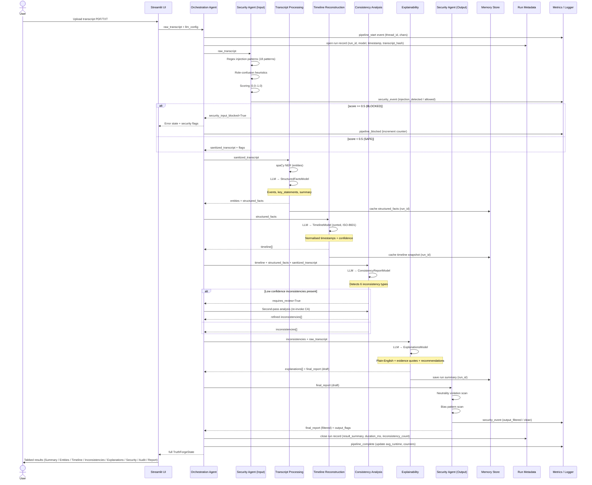

# TRUTHFORGE AI — Data Flow Diagram



---

## State Object at Each Stage

```
START
  raw_transcript: "COURT HEARING..."

After SEC_IN:
+ sanitized_transcript: (cleaned)
+ security_input_flags: []
+ security_input_blocked: false
+ agent_statuses: {security_input: {status: "complete", confidence: "HIGH"}}

After TP:
+ entities: [{text, label, confidence, start, end}, ...]
+ structured_facts: {events: [...], key_statements: [...], summary: "..."}
+ agent_statuses: {..., transcript_processing: {status: "complete"}}

After TR:
+ timeline: [{event_id, description, timestamp, normalized_time, actors, location}, ...]
+ agent_statuses: {..., timeline_reconstruction: {status: "complete"}}

After CA:
+ inconsistencies: [{inconsistency_id, type, statement_a, statement_b, severity}, ...]
+ requires_review: false
+ agent_statuses: {..., consistency_analysis: {status: "complete", confidence: "HIGH"}}

After EX:
+ explanations: [{inconsistency_id, plain_english, evidence_quotes, confidence, recommendation}, ...]
+ final_report: "# TRUTHFORGE AI — Consistency Analysis Report..."
+ agent_statuses: {..., explainability: {status: "complete"}}

After SEC_OUT:
+ final_report: (filtered)
+ security_output_flags: []

END
+ audit_log: [14 entries across all agents]
+ error_state: null
```

---

## Data Persistence Map

| Data | Format | Location | Retention |
|------|--------|----------|-----------|
| Structured facts cache | JSON | `memory/{run_id}_facts.json` | Per-run |
| Timeline snapshot | JSON | `memory/{run_id}_timeline.json` | Per-run |
| Run summary | JSON | `memory/{run_id}_summary.json` | Persistent |
| Run metadata | JSON | `artifacts/runs/{run_id}.json` | Persistent |
| Pipeline events | JSONL | `logs/events.jsonl` | Append-only |
| Aggregate metrics | JSON | `logs/metrics.json` | Persistent |
| Security events | JSONL | `logs/events.jsonl` (tagged) | Append-only |
