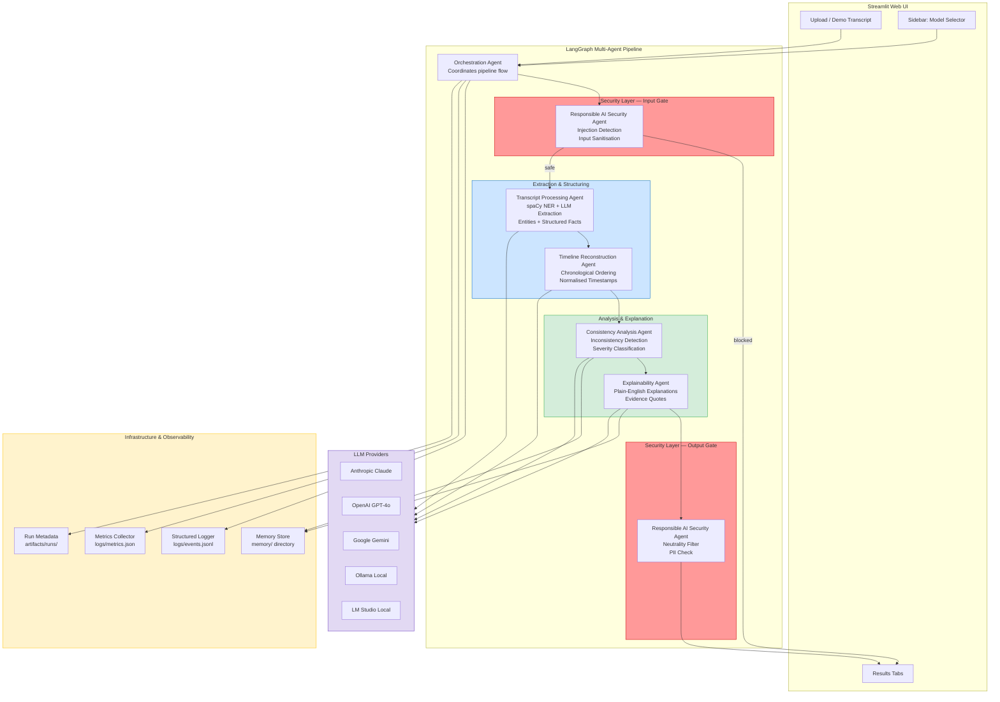

# TRUTHFORGE AI — Logical Architecture

## Layer Descriptions

| Layer | Purpose |
|-------|---------|
| **Streamlit UI** | User-facing web interface; handles file upload, model selection, and tabbed results display |
| **Orchestration Agent** | LangGraph StateGraph coordinator; manages node sequencing, conditional edges, retry logic |
| **Security Input Gate** | First line of defence; blocks/flags adversarial transcripts before any LLM processes them |
| **Transcript Processing** | Converts raw text into entities (spaCy NER) and structured events (LLM structured output) |
| **Timeline Reconstruction** | Normalises timestamps and sorts events chronologically |
| **Consistency Analysis** | Detects logical inconsistencies, temporal conflicts, and evolving testimony |
| **Explainability** | Generates plain-English explanations with evidence quotes and recommendations |
| **Security Output Gate** | Final filter; removes neutrality violations and redacts unsafe conclusions |
| **Infrastructure** | Logging, metrics, memory, and run metadata — cross-cutting observability concerns |
| **LLM Providers** | Pluggable cloud and local model backends via LangChain `init_chat_model` |
