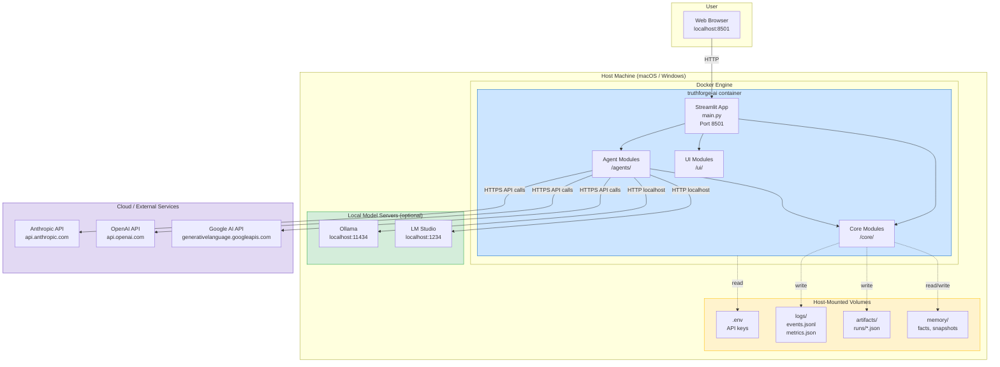

# TRUTHFORGE AI — Physical / Deployment Architecture



## Deployment Configurations

### Development (macOS)
```bash
# Direct Python
streamlit run main.py

# Or Docker
docker compose up --build
```

### Production (Docker)
```yaml
# docker-compose.yml
services:
  truthforge:
    build: .
    ports: ["8501:8501"]
    volumes:
      - ./.env:/app/.env:ro
      - ./logs:/app/logs
      - ./artifacts:/app/artifacts
      - ./memory:/app/memory
    environment:
      - PYTHONUNBUFFERED=1
```

### Windows Distribution
```
TRUTHFORGE_AI_Windows.zip
├── 1_SETUP.bat      → docker build
├── 2_START.bat      → docker compose up
├── 3_STOP.bat       → docker compose down
└── .env.example     → user fills in API keys
```

## Port and Network Map

| Service | Port | Protocol | Direction |
|---------|------|----------|-----------|
| Streamlit UI | 8501 | HTTP | Inbound (browser → container) |
| Anthropic API | 443 | HTTPS | Outbound (container → cloud) |
| OpenAI API | 443 | HTTPS | Outbound (container → cloud) |
| Google API | 443 | HTTPS | Outbound (container → cloud) |
| Ollama | 11434 | HTTP | Outbound (container → host) |
| LM Studio | 1234 | HTTP | Outbound (container → host) |

## Resource Requirements

| Resource | Minimum | Recommended |
|----------|---------|-------------|
| RAM | 2 GB | 4 GB |
| CPU | 2 cores | 4 cores |
| Disk | 5 GB (Docker image) | 10 GB |
| Network | Required for cloud LLMs | — |
